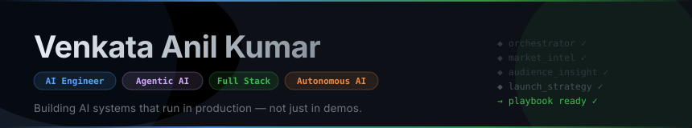

 

---

I design and build AI systems that actually work in production. My focus is on the hard parts — agentic reasoning, reliable orchestration, and full-stack execution — because good ideas only matter when they survive contact with real users and real scale.

---

## Currently Building

**[Qvora](https://github.com/VenkataAnilKumar/Qvora)** — Creative intelligence platform that takes a product URL and generates short-form video ads end-to-end. Built on an agentic pipeline that scores output quality, learns from performance signals, and continuously improves creative results without manual iteration.

**[SELPH](https://github.com/VenkataAnilKumar/SELPH)** — Personal AI digital twin that learns your voice, expertise, and communication style to draft replies across Instagram, Gmail, and more — nothing sends without your approval. Built on LangGraph with human-in-the-loop orchestration, voice cloning, and full audit trails.

---

## Flagship Projects

| Project | Focus | Value |
|---|---|---|
| [Qvora](https://github.com/VenkataAnilKumar/Qvora) | Creative intelligence SaaS | Turns a product URL into polished video ads with no manual creative work |
| [LaunchIQ](https://github.com/VenkataAnilKumar/LaunchIQ) | Multi-agent GTM automation | Cuts GTM planning from weeks to hours with an automated launch playbook |
| [Optivue](https://github.com/VenkataAnilKumar/Optivue) | AI analytics platform | Faster operational decisions with AI-surfaced insights and anomaly detection |
| [ParallaxAI](https://github.com/VenkataAnilKumar/ParallaxAI) | Intelligent automation platform | Eliminates manual coordination overhead with autonomous product workflows |
| [ALIV](https://github.com/VenkataAnilKumar/ALIV) | Local-first document intelligence | Secure, private AI for legal and finance document review — no data leaves the machine |
| [ArchonAI](https://github.com/VenkataAnilKumar/ArchonAI) | Agent architecture toolkit | Reusable patterns for building reliable, production-grade agent systems |

---

## Core Expertise

- **Agentic AI** — multi-agent orchestration, tool use, memory, planning loops, and autonomous workflow design
- **AI Backend** — LLM application engineering, RAG pipelines, prompt architecture, evals, and scalable AI APIs
- **AI Full Stack Product** — end-to-end product execution from backend systems to production-grade UIs
- **Forward Deployed Engineering** — embedding directly with customers to scope, build, and ship AI solutions fast

---

## Skills

**AI & Agents**

**Backend**

**Frontend**

**Infrastructure**

---

## Open To

AI Engineer, Agentic AI Engineer, Autonomous Systems Engineer, and Forward Deployed Engineering roles — remote or on-site.

vanilkumarch@gmail.com · linkedin.com/in/venkataanilkumar

